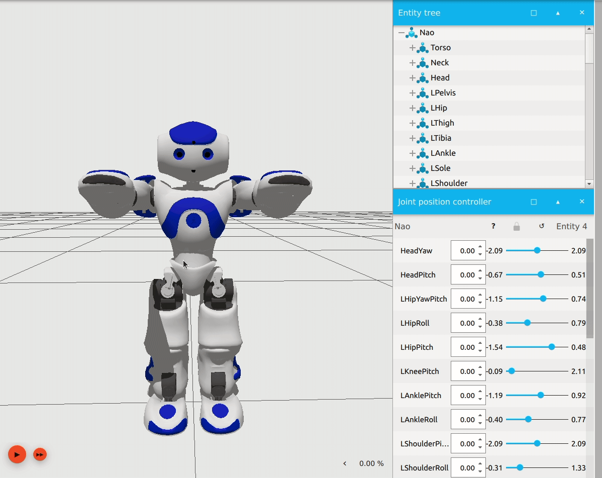
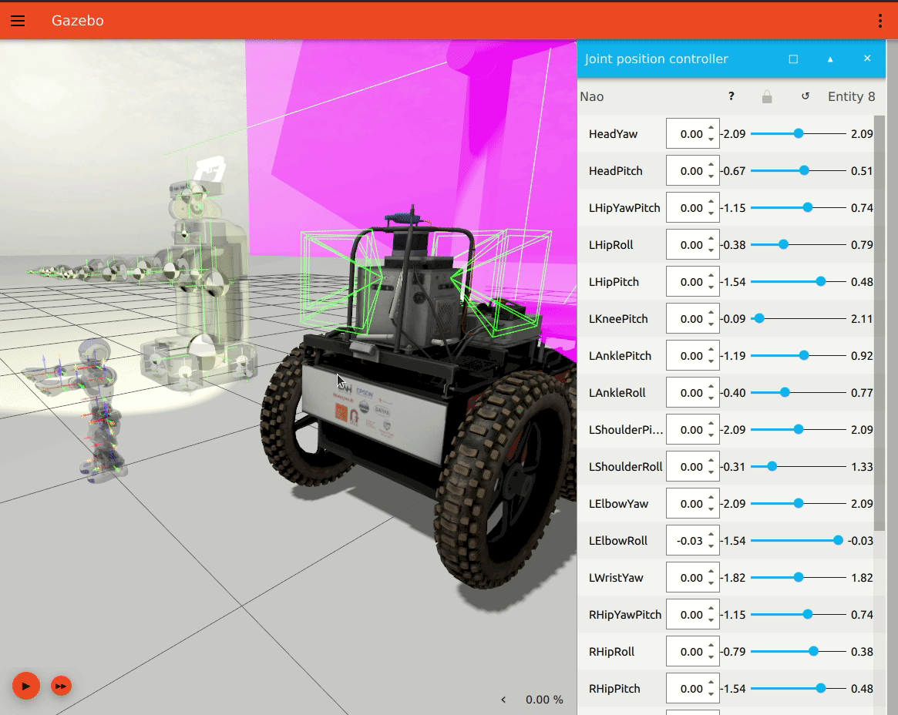

# GSoC 2021
Google Summer of Code Project with Open Robotics - New GUI Widgets in Ignition Gazebo


This repository describes my work during the Google Summer of Code 2021 program with Open Robotics.

## Project Description

In the summer of 2021, we at Open Robotics worked on developing new visualization capabilities for the Ignition Gazebo Robotics Simulator, using GUI widgets.

In the past, developing simulations worlds was a trial and error process, and users often had to provide computed values for robot inertia, joints, and mass properties, and hope that they will work in the simulation directly. If the physical behavior of the robot differed from what the user expected, there was no way to visualize what went wrong in the simulation world.

Due to the growing user base of the newer simulator, with finding its applications in the industry and competitions such as the DARPA SubT challenge, it was becoming imperative to add capabilities to visualize values coming from the physics engine of Gazebo. Hence, this project was undertaken to add new features to visualize the robot inertia, mass, joints, and more at runtime.

## Project Breakdown

This project involves working on two Ignition projects - Gazebo and Rendering. The visual classes are first added to the Rendering library which is then consumed by the downstream Gazebo project. A total of 9 pull requests were made during this project.

### Visualize as Wireframe

Users often need to debug their 3D meshes, hence we added a wireframe rendering mode to visuals, similar to Gazebo Classic

Ignition Rendering Pull Request - https://github.com/ignitionrobotics/ign-rendering/pull/314

Ignition Gazebo Pull Request - https://github.com/ignitionrobotics/ign-gazebo/pull/816



### Visualize as Transparent

You can now make a robot model or its link transparent in Gazebo, to help you see its other aspects more clearly.

Ignition Gazebo Pull Request - https://github.com/ignitionrobotics/ign-gazebo/pull/878


### Visualize Inertia

Visualize the inertia of a robot model or link using its physics inertia properties (No more adding values in SDF files blindly).

Ignition Rendering Pull Request - https://github.com/ignitionrobotics/ign-rendering/pull/326

Ignition Gazebo Pull Request - https://github.com/ignitionrobotics/ign-gazebo/pull/861


### Visualize Center of Mass

Visualize the center of mass of a robot model or link, using the same inertia values.

Ignition Rendering Pull Request - https://github.com/ignitionrobotics/ign-rendering/pull/345

Ignition Gazebo Pull Request - https://github.com/ignitionrobotics/ign-gazebo/pull/903


### Visualize Joints (Under progress)

You can now visualize the joints of a robot while simulating or building it. This visualization will be extended in the future to planned features such as the model and joint editor.

Ignition Rendering Pull Request - https://github.com/ignitionrobotics/ign-rendering/pull/366

Ignition Gazebo Pull Request - https://github.com/ignitionrobotics/ign-gazebo/pull/961


Besides the above-mentioned, I have also added features such as the about dialog and light intensity fields during the pre-GSOC period.

We hope that this project will provide a better user experience to existing users and bring more people under the Ignition project by reducing the feature gap between the two simulators.

These new visualizations will be released to the public with Ignition Fortress in September 2021.

## Testing

You can test the new features by installing Ignition Fortress from Nightly builds and using the demo world provided in this repository.

After downloading, you can run the simulation by
```
ign gazebo -v 4 visualization_demo.sdf
```



## Acknowledgments

I thank my mentor, Alejandro Hernández Cordero, for supporting and guiding me during the entire program and before it. Thanks to the whole Open Robotics team for providing me with this opportunity, reviewing my work, and assisting me with the project.

The non-programming part was just as much of an experience, if not more. The weekly team meetings were a great way of looking into project management and workflows. Now, I am looking forward to giving my project presentation at the Ignition Fortress Demos Community Meeting.

The work has helped me improve my programming skills, and I learned a great deal about 3D rendering and physics simulation.

## About Me

I am a final-year undergraduate engineering student at DJ Sanghvi College of Engineering, University of Mumbai pursuing Electronics Engineering.


I primarily work with autonomous robotics and self-driving software. I have been a part of the Formula Student team of my institute where we are building a self-developed autonomous race car. Through the team, I gained hands-on experience in robot navigation and perception and motivated me to further explore ROS and Gazebo. I have also worked at a startup to develop and deploy autonomous navigation software for use in warehouse environments.

During my time at Open Robotics, I had the opportunity to directly work on features that were being used by people in the robotics industry and academia.

Thank you for reading.
